# Setting up shared folder in server

**In this repo I am creating a folder in 

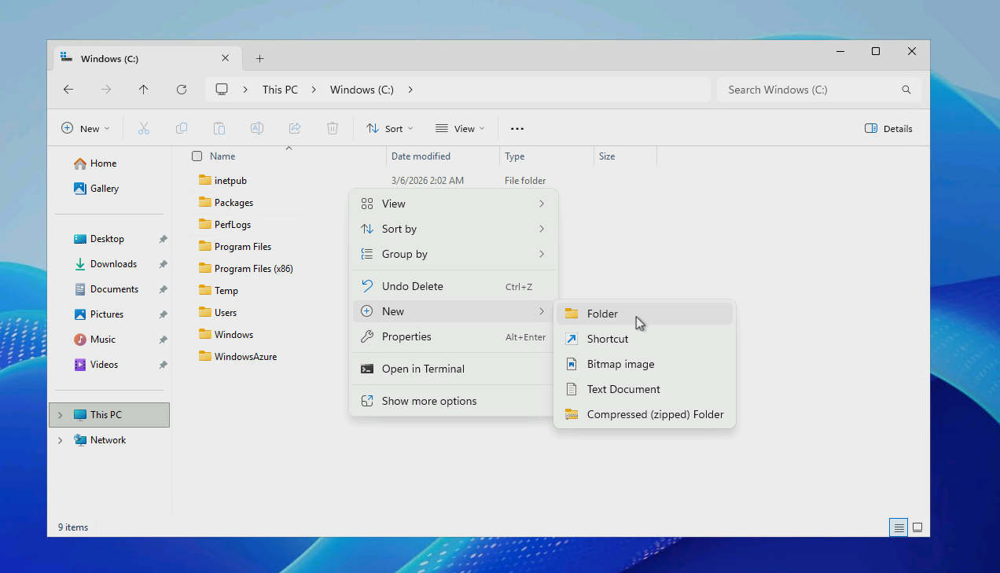
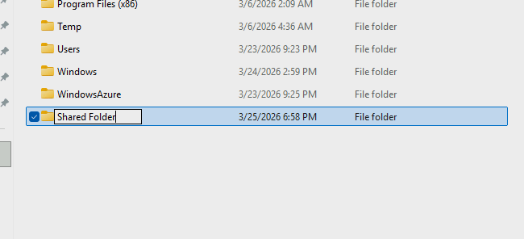
### Creating Folder
**I am creating the folder for the client to be able to send and receive files between client and server computers**  

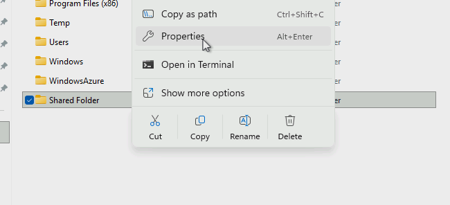
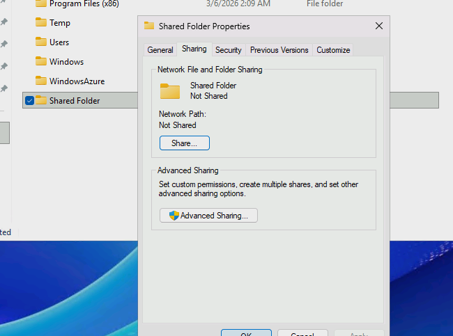 
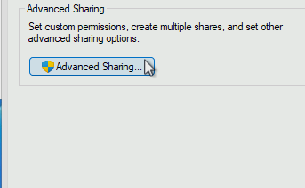
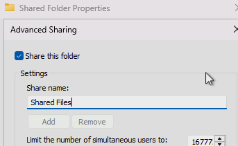
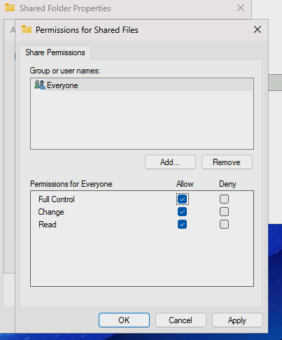 
**These images show me making the folder able to share files.**  

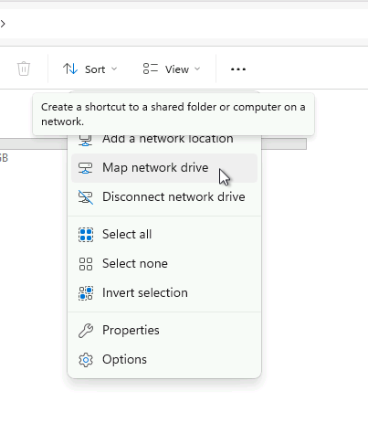
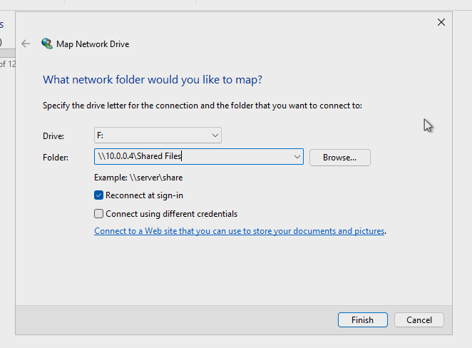
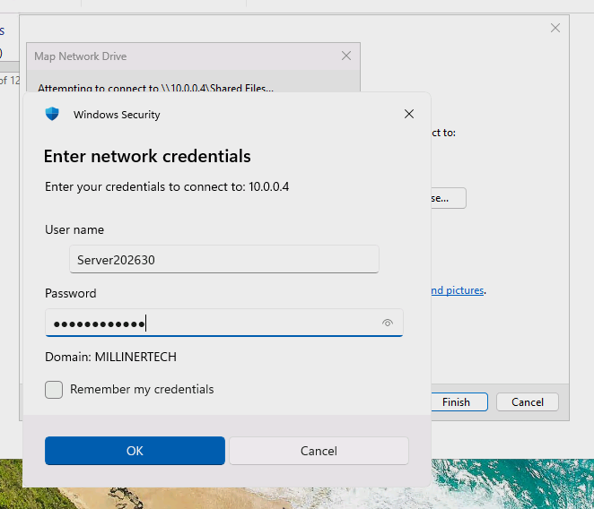
### Mapping folder

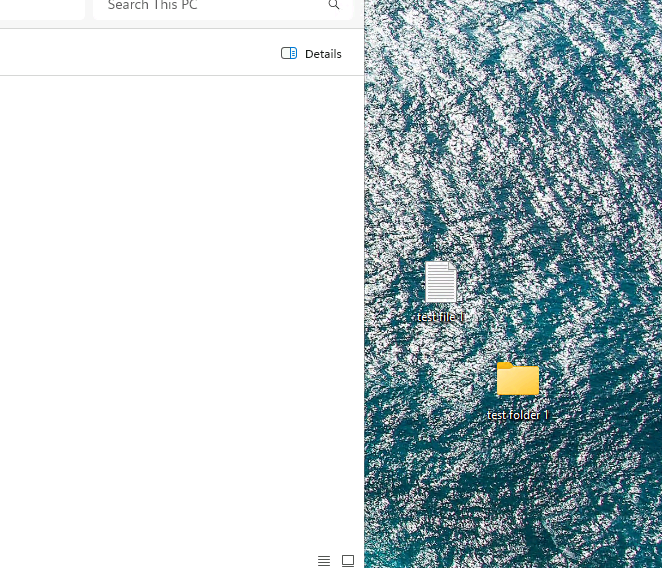
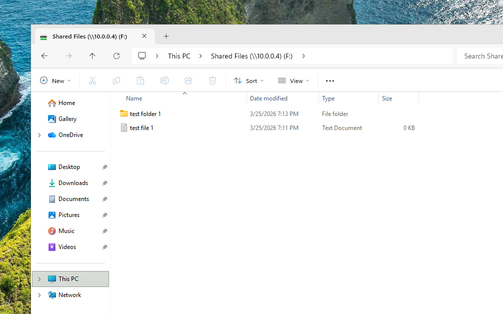
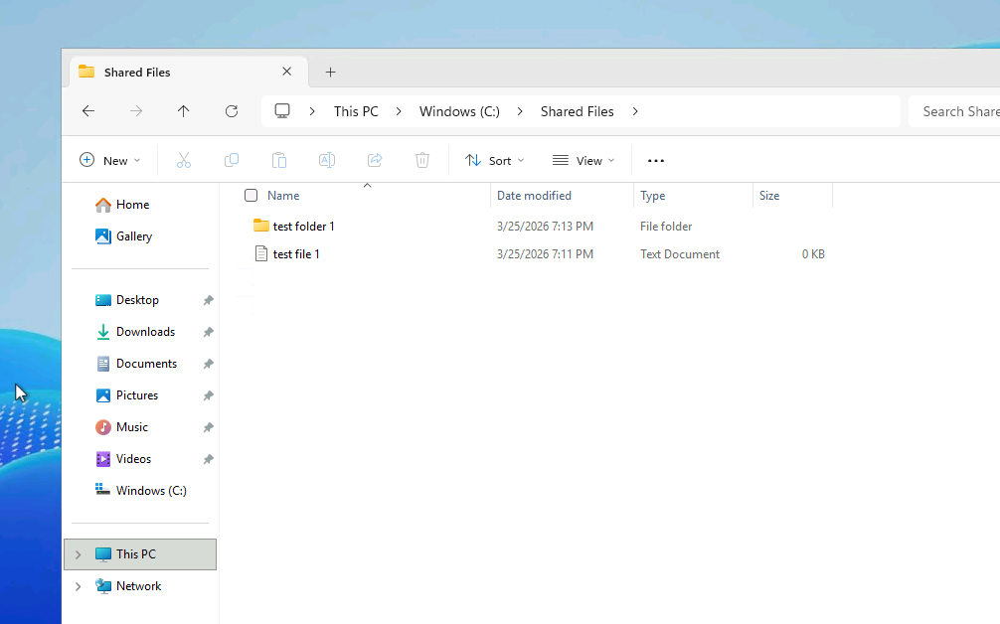
**Here, I am testing the folder to see if the test file and test folder are going to show up in the "Shared Files" folder on server when I add files from the client computer. (It was successful)**

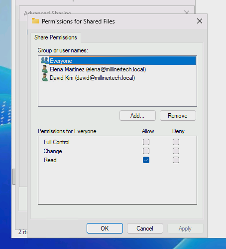
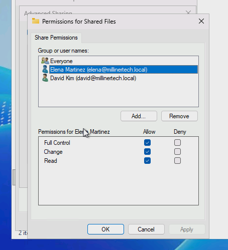
**I went back to change the permissions a little and full control to certain users and less control to others**
